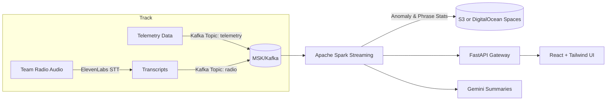

# 🏎️ F1 Race Engineer AI
### Real-Time Radio Codeword Decoding & Driver Anomaly Detection

[](https://opensource.org/licenses/MIT)
[](https://www.python.org/downloads/)
[](https://reactjs.org/)
[](https://fastapi.tiangolo.com/)

---

## 🚀 Overview

**F1 Race Engineer AI** is a real-time analytics platform designed to support Formula 1 race engineers.
It creates an **AI agent per driver** that learns each driver's "normal" driving behavior after a few laps, detects anomalies, and correlates them with **team radio commands** transcribed via **ElevenLabs Speech-to-Text**.

Goal: **Decrypt team codewords** — e.g., identifying that "full speed ahead" consistently triggers a speed increase.

---

## ✨ Features

- 🧠 **AI-Powered Anomaly Detection**: Machine learning algorithms detect unusual driving patterns
- 🎙️ **Real-Time Radio Transcription**: ElevenLabs Speech-to-Text for team communications
- 📊 **Live Telemetry Visualization**: Real-time F1 data with galaxy-themed UI
- 🔍 **Codeword Analysis**: Correlate radio phrases with driving behavior changes
- 📈 **Performance Analytics**: Driver summaries and trend analysis
- ☁️ **Cloud-Native Architecture**: Scalable Kubernetes deployment
- 🌌 **Immersive UI**: Celestial-themed dashboard with real-time updates

---

## 🧠 Core Concept

- **Driver agents:** Learn per-driver patterns and detect anomalies.
- **Speech correlation:** Align driving anomalies with radio phrases.
- **ElevenLabs:** Converts open radio into timestamped transcripts.
- **Gemini API:** Generates live driver summaries every few laps.
- **React + Tailwind UI:** Visualizes real-time data with a celestial theme.

---

## 🏗️ System Architecture



---

## ☁️ Cloud Stack

| Layer | Service | Purpose |
|:--|:--|:--|
| Agents | DigitalOcean Kubernetes | Runs simulators, workers, and gateway |
| Stream | Kafka (MSK or Bitnami Helm) | Telemetry & radio ingestion |
| Processing | Apache Spark (on K8s or EMR) | Anomaly & correlation detection |
| Storage | S3 or Spaces | Data lake + checkpoints |
| Catalog | Glue + Athena (AWS) | Queryable data tables |
| Summaries | Gemini API | AI driver summaries |
| Transcription | ElevenLabs | Speech-to-text for radio |
| Frontend | React + Tailwind | Galaxy-themed dashboard |

---

## 💾 Data Models

### Telemetry
```json
{
  "ts": "2025-10-18T18:30:01.235Z",
  "driver_id": "DRIVER_A",
  "lap": 7,
  "distance_m": 3612.4,
  "sector": 2,
  "track_x": 0.83,
  "speed_kph": 281.7,
  "throttle_pct": 0.96,
  "brake_pct": 0.02,
  "gear": 7
}
```

### Radio Transcripts
```json
{
  "ts": "2025-10-18T18:30:01.120Z",
  "team": "TEAM_X",
  "driver_id": "DRIVER_A",
  "text": "Full speed ahead"
}
```

### Anomaly Events
```json
{
  "ts": "2025-10-18T18:30:01.400Z",
  "driver_id": "DRIVER_A",
  "feature": "speed_kph",
  "score": 3.2,
  "value": 281.7,
  "baseline": 270.4
}
```

### Phrase Correlation Stats
```json
{
  "phrase": "full speed ahead",
  "driver_id": "DRIVER_A",
  "window_s": 5,
  "count": 12,
  "p(anomaly|phrase)": 0.67,
  "top_features": ["speed_kph", "throttle_pct"]
}
```

---

## 🧩 Data Flow

1. **Simulator** generates telemetry + radio streams.
2. **Kafka** handles telemetry/radio topics.
3. **Spark Streaming** detects anomalies and correlations.
4. **Gemini** produces live summaries.
5. **Gateway** relays data to the **React UI** via WebSocket.

---

## 🚀 Quick Start

### Prerequisites

- Docker & Docker Compose
- Node.js 18+ (for local development)
- Python 3.11+ (for local development)
- kubectl (for Kubernetes deployment)
- Terraform (for infrastructure deployment)

### Local Development

1. **Clone the repository**
   ```bash
   git clone https://github.com/yourusername/f1-race-engineer-ai.git
   cd f1-race-engineer-ai
   ```

2. **Set up environment variables**
   ```bash
   cp env.example .env
   # Edit .env with your API keys
   ```

3. **Deploy locally**
   ```bash
   ./scripts/deploy.sh local
   ```

4. **Access the application**
   - Frontend: http://localhost:3000
   - Backend API: http://localhost:8000
   - Kafka: localhost:9092

### Production Deployment

#### AWS Infrastructure
```bash
# Deploy AWS infrastructure
./scripts/deploy.sh infrastructure aws

# Deploy to Kubernetes
./scripts/deploy.sh k8s
```

#### DigitalOcean Infrastructure
```bash
# Deploy DigitalOcean infrastructure
./scripts/deploy.sh infrastructure digitalocean

# Deploy to Kubernetes
./scripts/deploy.sh k8s
```

---

## 🧱 Terraform Setup (AWS + DigitalOcean)

### AWS Infrastructure
- S3, Glue, Athena, MSK, EMR Serverless, Secrets Manager
- Use `infra/terraform` to deploy
```bash
cd infra/terraform
terraform init && terraform apply -auto-approve
```

### DigitalOcean Kubernetes (DOKS)
- Creates VPC, Spaces, DOKS cluster, Kafka (Bitnami Helm), and Ingress
```bash
cd infra/doks-terraform
terraform init && terraform apply -auto-approve
```

Fetch kubeconfig:
```bash
doctl kubernetes cluster kubeconfig save $(terraform output -raw doks_name)
```

Deploy app:
```bash
kubectl apply -f k8s/
```

---

## ☸️ Kubernetes Components

| Component | Purpose |
|:--|:--|
| simulator | Generates live telemetry |
| gateway | WebSocket relay (FastAPI) |
| transcriber | ElevenLabs STT worker |
| summarizer | Gemini summarization worker |
| ingress-nginx | Public access |
| kafka | Internal cluster bus |

---

## 🎨 UI Theme

- Navy blue `#0b1b3b` background with white galaxy glow.  
- Real-time driver panels with speed/throttle/brake gauges.  
- Live "codeword" probability indicators.  

---

## 📦 Development Commands

```bash
# Install all dependencies
npm run install-all

# Start development servers
npm run dev

# Run telemetry simulator
npm run simulator

# Build Docker images
./scripts/deploy.sh build

# Deploy to Kubernetes
./scripts/deploy.sh k8s

# Clean up resources
./scripts/deploy.sh cleanup
```

---

## 🔧 Configuration

### Environment Variables

| Variable | Description | Default |
|----------|-------------|---------|
| `ELEVENLABS_API_KEY` | ElevenLabs API key for speech-to-text | Required |
| `GEMINI_API_KEY` | Google Gemini API key for AI summaries | Required |
| `KAFKA_BOOTSTRAP_SERVERS` | Kafka broker addresses | localhost:9092 |
| `TELEMETRY_TOPIC` | Kafka topic for telemetry data | telemetry |
| `RADIO_TOPIC` | Kafka topic for radio transcripts | radio |
| `REDIS_URL` | Redis connection URL | redis://localhost:6379 |

### API Keys Setup

1. **ElevenLabs**: Sign up at [elevenlabs.io](https://elevenlabs.io) and get your API key
2. **Google Gemini**: Get your API key from [Google AI Studio](https://makersuite.google.com/app/apikey)

---

## 🧠 Future Enhancements

- Integrate **LSTM autoencoders** for anomaly detection.  
- Add **real radio feeds** from public APIs.  
- Build **driver style profiling** over races.  
- Integrate **real telemetry APIs** for Formula Student teams.
- Add **machine learning model training** pipeline
- Implement **real-time video analysis** for driver behavior
- Add **predictive analytics** for race outcomes

---

## 🤝 Contributing

1. Fork the repository
2. Create a feature branch (`git checkout -b feature/amazing-feature`)
3. Commit your changes (`git commit -m 'Add some amazing feature'`)
4. Push to the branch (`git push origin feature/amazing-feature`)
5. Open a Pull Request

---

## 📜 License

MIT License © 2025 Sahishnu "Sahi" Sagiraju  
Use freely for educational & research purposes.

---

## 🙏 Acknowledgments

- Formula 1 teams for inspiration
- ElevenLabs for speech-to-text technology
- Google for Gemini AI capabilities
- The open-source community for amazing tools

---

## 📞 Support

For questions, issues, or contributions, please:
- Open an issue on GitHub
- Contact: [your-email@example.com](mailto:your-email@example.com)
- Follow on Twitter: [@yourusername](https://twitter.com/yourusername)